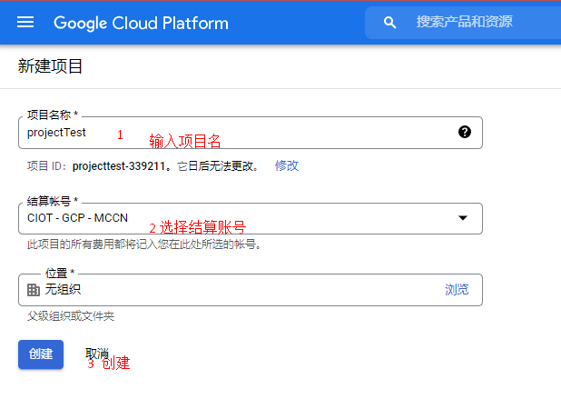
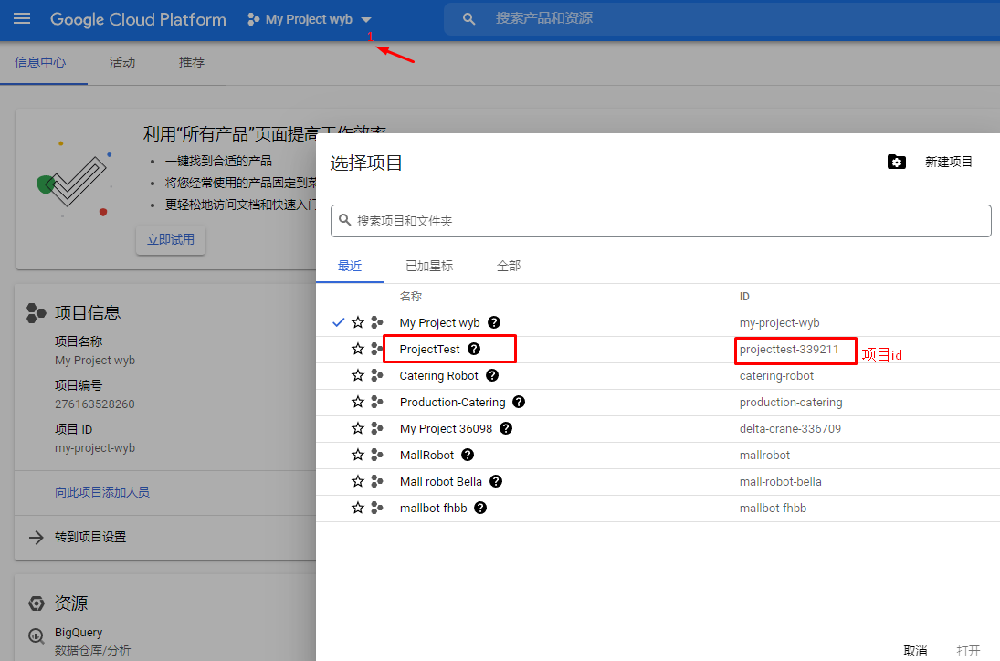
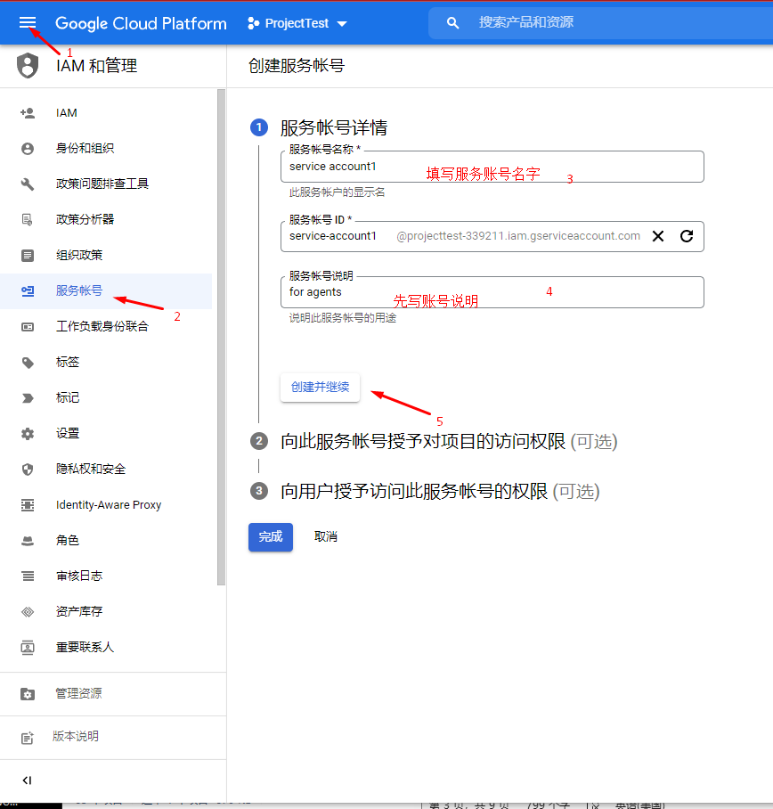
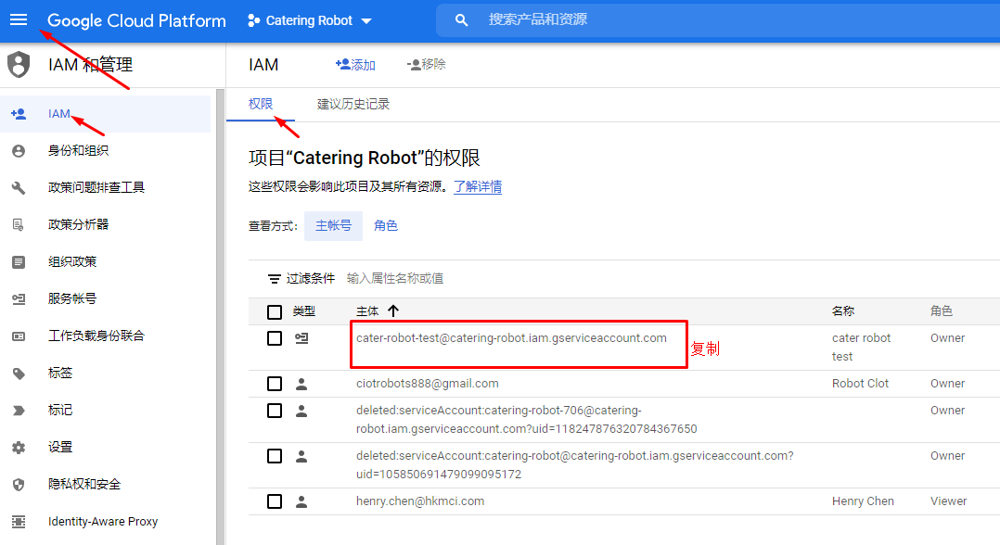
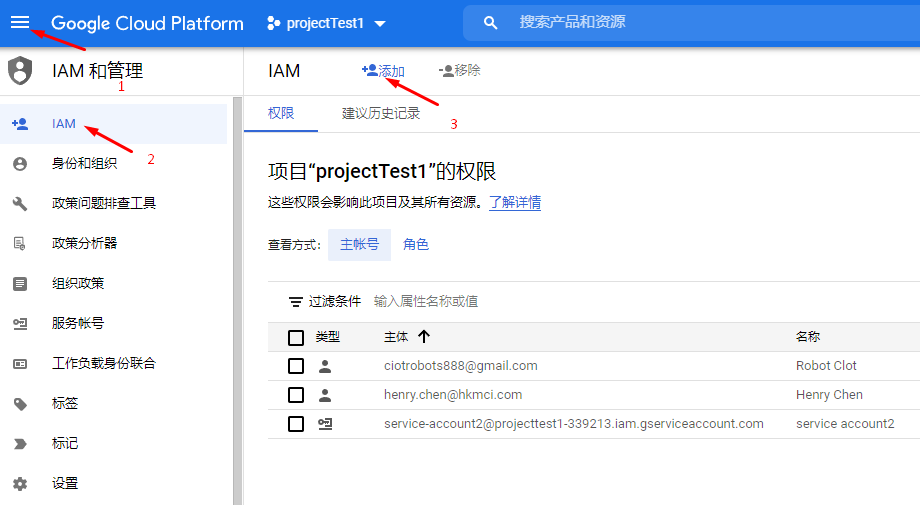
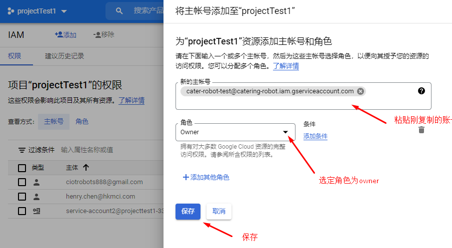

- [1. 创建Google Cloud 项目](#1---google-cloud---)
  * [1.1 登录google cloud platform](#11---google-cloud-platform)
  * [1.2 新建项目](#12-----)
    + [1.2.1 步骤1：](#121---1-)
    + [1.2.2 步骤2：](#122---2-)
  * [1.3 为该项目创建服务账号](#13-----------)
    + [1.3.1 什么是服务账号？](#131---------)
    + [1.3.2 创建步骤](#132-----)
      - [1.3.2.1 步骤1](#1321---1)
      - [1.3.2.2 步骤2](#1322---2)
      - [1.3.2.3 步骤3](#1323---3)
  * [1.4 为该服务账号创建其密匙](#14------------)
    + [1.4.1 步骤1](#141---1)
    + [1.4.2 步骤2](#142---2)
  * [1.5 最佳做法与解决方案](#15----------)
    + [1.5.1 谷歌技术人员给出的建议：](#151-------------)
    + [1.5.2 具体步骤：](#152------)
    + [3. 设置环境变量](#3-------)
    + [3.1 windows+pycharm的环境变量设置。](#31-windows-pycharm--------)
    + [2.2 linux, mac用户的环境变量设置](#22-linux--mac---------)
- [2.代理、流、页面](#2-------)
  * [2.1 创建dialogflow cx 代理](#21---dialogflow-cx---)
- [3. dialogflow 控制台面板功能介绍](#3-dialogflow----------)
      - [3.1 Build](#31-build)
      - [3.2 Manage](#32-manage)
    + [3.3 Agent Test](#33-agent-test)
      - [3.4 Agent settings](#34-agent-settings)
- [4. 流、页面、意图、实体、参数的概念](#4-----------------)
  * [4.1 流](#41--)
      - [4.1.1 流的特点](#411-----)
      - [4.1.2 流的初始页面](#412-------)
  * [4.2 页面](#42---)
    + [4.2.1 页面的特点：](#421-------)
      - [1.Routes：](#1routes-)

<small><i><a href='http://ecotrust-canada.github.io/markdown-toc/'>Table of contents generated with markdown-toc</a></i></small>

# 1. 创建Google Cloud 项目

## 1.1 登录google cloud platform

[登录链接](https://console.cloud.google.com/user-preferences/cloud-profile)

## 1.2 新建项目

### 1.2.1 步骤1：

### 1.2.2 步骤2：

​			注：一个google 账号可以创建25个项目，如需要创建更多项目，需要申请开通。

​				稍等几分钟，刷新 google cloud platform, 刚创建的项目已经展示在项目列表里

​				

## 1.3 为该项目创建服务账号 

### 1.3.1 什么是服务账号？

是一个供计算机用的虚拟账号，用来访问Google Cloud资源。
[链接](https://cloud.google.com/iam/docs/service-accounts?hl=zh-cn&_ga=2.98308319.-139742340.1639388700)

### 1.3.2 创建步骤

#### 1.3.2.1 步骤1

#### 1.3.2.2 步骤2 

#### 1.3.2.3 步骤3

## 1.4 为该服务账号创建其密匙

### 1.4.1 步骤1

### 1.4.2 步骤2

选择json,点击创建后自动下载json格式的密匙，稍后将会用到。

## 1.5 最佳做法与解决方案

### 1.5.1 谷歌技术人员给出的建议：
为一个谷歌项目创建其对应的服务账号，如果有多个谷歌项目，就需要多个服务账号，这样方便账单的计算。 这样基于最小权限原则，对项目管理也相对安全。 

基于公司的业务需求，服务账号该以如下方法进行管理。 

客观因素：
1. 在linux环境变量中只能设置一个json密匙。
2. 一个谷歌项目对应一个的dialogflow cx项目，一个谷歌项目需要一个与之对应的服务账号，一个服务账号可以选择生成或者不生成密匙。通过密匙，我们可以使用客户端或者API的方式访问该dialogflow cx项目的相关信息和功能，使用项目A的json密匙不可以访问项目B的任何信息，这导致了我们无法用一个把密匙访问多个dialogflow cx项目。

解决方法：

将其中一个服务账号作为父账号，其功能是生成json密匙，我们可以根据需求将父账号的作为owner的角色添加到子账号。 谷歌的服务账号本身并没有父子等级关系，这样做完全基于公司的的业务管理需求。
以此达到了使用一把json密匙，访问到多个dialogflow cx项目

### 1.5.2 具体步骤：
假如现在有两个project，分别为projectTest1，catering Robot。 这两个项目都已经通过上面的方式建立了自己的服务账号，我们想要做到用catering Robot的密匙访问projectTest1.

步骤1：
复制catering Robot的服务账号。

步骤2：
添加catering robot的服务账号到projectTest1，并给予owner权限。

### 3. 设置环境变量

[链接](https://cloud.google.com/iam/docs/service-accounts?hl=zh-cn&_ga=2.98308319.-139742340.1639388700)

拿到上一步下载的json密匙绝对路径

### 3.1 windows+pycharm的环境变量设置。

以下配置方法生效范围为整个pycharm项目目录

假设你的json密匙绝对路径为：C:\Users\admin\xxxx\xxxbcb6202b4.json

环境变量格式： GOOGLE_APPLICATION_CREDENTIALS=C:\Users\admin\xxxx\xxxbcb6202b4.json

选中pycharm项目中任一py文件，单击右上角。

在红色框出输入GOOGLE_APPLICATION_CREDENTIALS=C:\Users\admin\xxxx\xxxbcb6202b4.json

点击apply，这样你就可以访问谷歌项目了。

### 2.2 linux, mac用户的环境变量设置

可以直接把json密匙路径配置到用户环境变量，生效范围为该linux系统的用户，当然你也可也设置linux系统级的环境变量（参照链接：https://www.cnblogs.com/lihao-blog/p/6945040.html）

下面展示把json密匙配置到linux用户级的环境变量。

1 进入用户的根目录

cd  $HOME 或 cd ~

$ vim  .bashrc

2 然后打开.bashrc若不存在则新建.bashrc文件

vim  .bashrc

3 在.bashrc页面最后加上想要加的路径

export GOOGLE_APPLICATION_CREDENTIALS=/var/www_r/www_bot/catering-robot-aecbcb6202b4.json

请将json密匙的地址替换为你的绝对路径。

4 最后执行

source ~/.bashrc

搞定！

# 2.代理、流、页面

## 2.1 创建dialogflow cx 代理

[登录链接](https://dialogflow.cloud.google.com/cx/projects)

登录后，在project下拉框，你会发现刚刚创建的google could 项目 projectTest已经显示到了这里。

1.点击 Enable API ->create agent

下面截图说明：

Displayname: 代理名字，一个location下的代理名字不能重复，

location：代理所在的google服务器的区域，这会影响到意图识别的访问速度，建议就近原则。代理位置一旦选定，不可以改变。 

Default language：代理使用的语言，这决定了意图识别、实体的主要语言，一个代理只能选中一门语言作为主识别语言。 虽然你可以把多国语言作为训练语句加入意图，但这样做不利于管理。 

Time zone：代理所用的时间

代理创建说明：
dialogflow代理id为谷歌自动生成，创建代理成功后可以通过API或者客户端库拿到代理的id，也可以在控制台的导航栏查看代理的id。

一个google dialogflow cx项目（也叫google cloud项目）下可以创建1000个代理，具体参数限制如下表。

# 3. dialogflow 控制台面板功能介绍

#### 3.1 Build

#### 3.2 Manage

Resources:

在这里可以管理意图、实体类型、网络钩子、路由组

Test & Feedback：

这里包含了代理的测试和分析功能

TESTING $DEPLOYMENT:

在这里可以进行流的版本控制，代理的环境管理等操作。

INTERGRETION:

代理与第三方平台的集成

Prebuild Agent：

谷歌预设好的代理。 

### 3.3 Agent Test

点击右边test Agent可对创作好的代理进行测试。

我在测试窗口中输入了 when is your store hours 

测试窗口

1. Default start flow 代表流名字，这里指页面Strore Hours所在的流名。

​		Strore Hours 代表页面名字,这里指意图store.hours所在的页面名字。

2.  store.hours 是当如输入测试语句后所命中的意图名

3. 点击小本本图标可以看到当前会话返回的详细json参数。

4. 点击垃圾箱的图标会清除当前会话的所有数据，再次输入语句测试的时候就会使用一个新的session id测试控制台的代理。

5. Execution steps： 点击下拉框可以看到当前会话的从开始到当前状态的执行步骤。

6. Environment: Draft:  这里的意思是当前测试的是草稿代理，如果建立了代理版本打开测试代理就会弹出代理版本供您选择测试。

   

#### 3.4 Agent settings

点击控制台右上角Agent setting->ML

参数说明：

NLU type：

这里是默认选择了标准NLU, 标准NLU会在更改草稿后自动训练，如果选择Advanced NLU，每次更新流就必须手动训练，这个选项适合大型流。 

Classification thredshould：

意图检测的阈值，如果意图匹配的置信度分数小于阈值，则会调用[无匹配事件](https://cloud.google.com/dialogflow/cx/docs/concept/handler#event-built-in)

# 4. 流、页面、意图、实体、参数的概念

## 4.1 流

#### 4.1.1 流的特点

 每个代理都有一个名为[默认初始流](https://cloud.google.com/dialogflow/cx/docs/concept/flow#start)的流。对于简单的代理，您可能只需要这一个流。较复杂的代理可能需要更多的流，不同的开发团队成员可以负责构建和维护这些流。也就是当业务广或很复杂的时候，我们可以把功能抽象出来，用一个流执行一类的功能操作，这样方便流的管理和后期流的版本控制。

多个流之间可以相互协作，数据可以共享。 

每个代理仅有一个默认的初始流，初始流是对话的入口。初始流的ID为00000000-0000-0000-0000-000000000000

每个流都有一个默认的start page，在调用该代理的API或使用客户端时，可以通过 pageId=START_PAGE 判断是否为开始流。

#### 4.1.2 流的初始页面

初始页面和普通的页面功能不一，在初始页里，你只可以：

1. 添加意图

2.不做任何操作，通过条件True执行其他操作

下面展示了如何在初始页添加条件True

3. 自定义事件Event Handler 事件处理器

4.1.3 流的增、删、导出、导入

流的操作有三种方式，1.通过API ([链接](https://cloud.google.com/dialogflow/cx/docs/concept/flow))。2.通过客户端([链接](https://googleapis.dev/python/dialogflow-cx/latest/dialogflowcx_v3beta1/services.html#google.cloud.dialogflowcx_v3beta1.services.flows.FlowsClient))。 3.通过控制台。 下面展示了通过控制台创建流。

4.1.3.1 增加流：

在dialogflow cx 控制台 ->点击build-> 点击 + 号->点击create flow->输入流名 ->回车保存

 4.1.3.2 删除流：

打开dialogflow cx 控制台 ->点击build-> 点击 + 号->点击Delete->输入流名 ->回车保存

建议的做法：

删除某个流的时候需要注意与之关联的页面、流等信息，要确保删除后其他页面或者流不受影响，如果该流以后可能需要，可以选择导出存到本地，或者为该流保存一个版本，关于流的版本，请参照流的版本控制。

 4.1.3.2 导出流：

打开dialogflow cx 控制台 ->鼠标移到要导出的流->点击三个点->点击Export flow ->回车保存

关于导出的位置有两个选项：

Cloud storage：把流存到谷歌云服务器，这个服务要额外购买。

Download：存到本地

 4.1.3.2 导入流：

这里仅展示将本地存储的流文件导入到代理。

步骤： 打开dialogflow cx 控制台 ->点击build -> 点击Flow 右边的 +号 ->选中upload local file -> 点击select file -> 选中本地存储的流文件点击“打开” -> 单击import 按钮

## 4.2 页面

[image-20220125170059852](C:\Users\admin\AppData\Roaming\Typora\typora-user-images\image-20220125170059852.png)

### 4.2.1 页面的特点：

- 上图中的每个节点为一个页面，一轮对话相当于一个状态机，一个页面反应了当前对话的状态。

- 在一个页面里可以添加意图

- 一个页面里包含了所有对话转换逻辑。

- 一个页面包含了intro

  

一个流可以由多个页面组成，每个流都有一个初始页面。

所以页面分为初始页面和普通页面。 

页面的功能：

#### 1.Routes：

 这里可以新增意图以及训练语句，或者加入已建立好的意图。

1.方式一： 直接新增：

点击上图的Routes旁边的加号 -> 输入意图名以及训练语句、根据情况标题参数 ->选中该意图 -> save

2.方式二： 先在意图管理区新增意图并输入好训练语句、参数标记等 -> 点击routes 右边的 加号 -> 在下拉列表中选中该意图 ->save

1．      表示一个会话的state，通俗来讲就是该对话进行到哪一步了。

2．      在某个页面可以添加意图、做参数收集、对话逻辑判断。 

